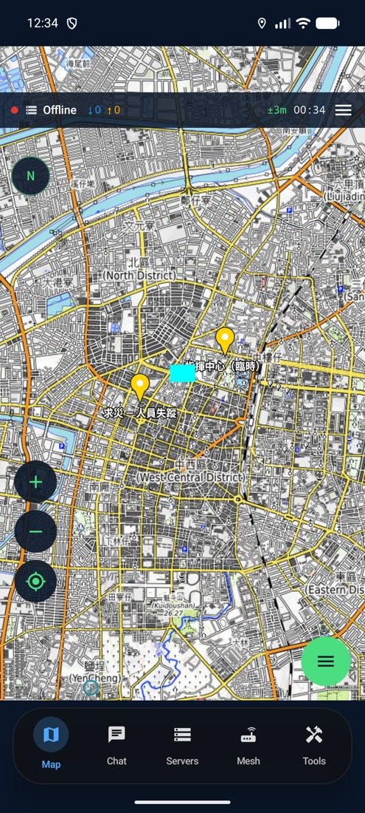
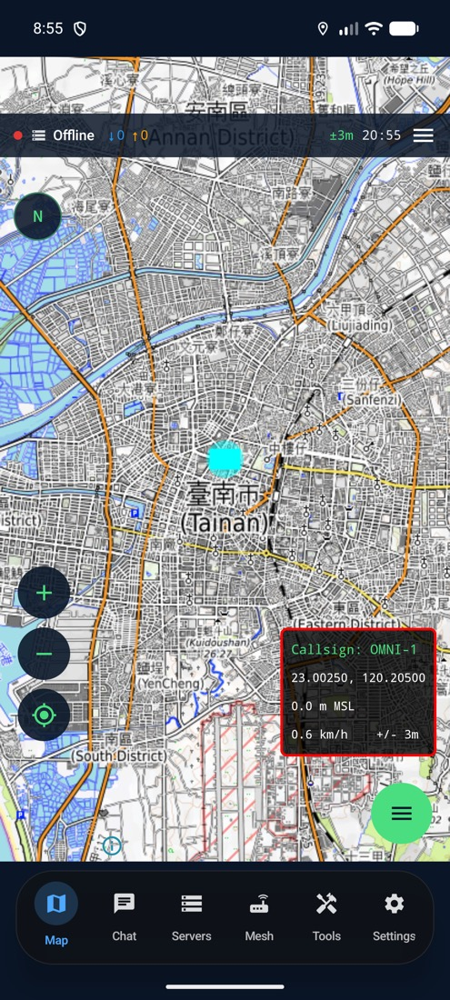
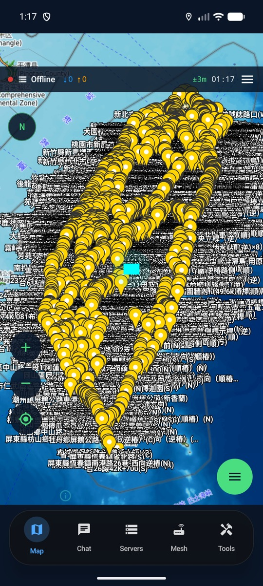

# OmniTAK-Android

[](LICENSE)

Open-source TAK (Team Awareness Kit) client for Android, built with Kotlin + Jetpack Compose.

OmniTAK speaks Cursor-on-Target (CoT) over TLS to any TAK Server, supports tactical map rendering via MapLibre, ADS-B traffic display, Meshtastic radios, drawing tools, and more, designed for search-and-rescue, civil defense, and outdoor operations.

> **Bring your own TAK Server.** OmniTAK is a client. Stand up [TAK Server](https://tak.gov) (community CIV edition), [OpenTAKServer](https://github.com/brian7704/OpenTAKServer), or [taky](https://github.com/tkuester/taky) and point OmniTAK at it.

## Testers wanted

OmniTAK for Android is in **Google Play closed testing**, and every tester helps push it toward the public Play Store release. The iOS build is already live on the [App Store](https://apps.apple.com/us/app/omnitakmobile/id6755246992).

**To test the Android build:** drop your Google-account email in the Beta section at **[omnitak.engindearing.soy](https://omnitak.engindearing.soy)** and you will get the install link by email. Free, no ads, Apache 2.0.

## Download

[](https://github.com/engindearing-projects/OmniTAK-Android/releases/latest)

**Current release: [v0.38.0 (versionCode 97)](https://github.com/engindearing-projects/OmniTAK-Android/releases/tag/v0.38.0)**. 2D map rendering batch: dropped markers, contacts, and operator drawings now render on the 2D map across all GPUs, imported KML renders fully (points, lines, and polygons) with clustering for large files, markers refresh instantly on create/edit/delete, and tap-to-edit + lasso select/delete reliably hit dropped markers. Builds on 0.37.0 (KML pins, red-framed coords, offline regions, icon-pack import, FEMA symbols, QR enrollment, EN/PL/DE/FR).

- **Signed APK (sideload):** [OmniTAK-0.38.0-vc97.apk](https://github.com/engindearing-projects/OmniTAK-Android/releases/download/v0.38.0/OmniTAK-0.38.0-vc97.apk)
- **Always-latest APK:** [releases/latest](https://github.com/engindearing-projects/OmniTAK-Android/releases/latest)
- **Google Play (closed testing):** [sign up at omnitak.engindearing.soy](https://omnitak.engindearing.soy) with your Google-account email

> **Upgrading?** versionCode is monotonic. Every release ratchets the integer up. Android allows in-place upgrade as long as the signing cert is unchanged.

Verify the APK before installing, signing cert SHA-256 should be `9f3b1fd54ad4eb1dc5b45d91deac4699869617d3d2ac425a1b70337aa0eb13af`:

```bash
apksigner verify --print-certs OmniTAK-0.38.0-vc97.apk
```

## Screenshots

| KML pins + labels | Red-framed coordinates | Large KML (1,286 placemarks) |
|---|---|---|
|  |  |  |

## Features

- **TAK Server connectivity**: TCP / TLS / mTLS with client-certificate enrollment
- **Cursor-on-Target**: full CoT XML parser, marker rendering, server messaging
- **Tactical map**: MapLibre Native Android with custom layers (contacts, drawing, aircraft, mesh nodes, grid, measurement)
- **ADS-B traffic**: aircraft overlay with bring-your-own provider
- **Meshtastic**: TCP connection to Meshtastic mesh radios
- **Drawing tools**: points, lines, polygons, range/bearing, measurement
- **Multi-server management**: connect to multiple TAK servers
- **Radial menu**: quick actions on map long-press
- **Material 3 dark theme**: tactical color palette

## Requirements

- Android 8.0 (API 26) or later
- Android Studio Ladybug or later (for development)
- JDK 17
- A TAK Server you can reach (BYO, see above)

## Getting started

```bash
git clone https://github.com/engindearing-projects/OmniTAK-Android.git
cd OmniTAK-Android
./gradlew assembleDebug
```

The debug APK lands at `app/build/outputs/apk/debug/app-debug.apk`.

To install on a connected device:

```bash
./gradlew installDebug
```

Or open the project in Android Studio and run normally, debug builds work out-of-the-box without any signing key configuration.

### Release builds (your own signing key)

To produce a release APK signed with your own upload key:

1. Generate an upload keystore:
   ```bash
   keytool -genkey -v -keystore my-upload.jks -keyalg RSA -keysize 2048 -validity 10000 -alias upload
   ```
2. Copy `keystore.properties.example` to `keystore.properties` (gitignored) and fill in your values
3. Build:
   ```bash
   ./gradlew assembleRelease
   ```

If `keystore.properties` is absent, release builds gracefully fall back to the debug signing config so the project always builds.

## Architecture

```
app/src/main/kotlin/soy/engindearing/omnitak/mobile/
├── data/            # Models + persistence (TAKServer, CoTEvent, ChatMessage, etc.)
├── domain/          # State stores (ServerManager, ChatStore, ContactStore, etc.)
└── ui/
    ├── screens/     # Top-level screens (Map, Servers, Chat, Meshtastic, Settings, etc.)
    ├── components/  # Reusable layers and widgets (TacticalMap, RadialMenu, etc.)
    ├── navigation/  # Compose Navigation graph
    └── theme/       # Material 3 theme + tactical colors
```

The app is pure Kotlin + Compose with no native bridge. A future release will integrate the shared OmniTAK Rust core via JNI. Its source is being prepared for separate open-source release as **OmniTAK-Core**.

### Plugins

OmniTAK ships a compile-time plugin SDK (`:plugins:plugin-sdk`) and a reference
plugin (`:plugins:example-adsb`, the ADS-B aircraft overlay). Plugins are
statically-linked Gradle modules, no dynamic/remote code, so the app stays
Play-Store compliant. See **[docs/PLUGIN_AUTHORING.md](docs/PLUGIN_AUTHORING.md)**
for the contract, the host seams (map overlay / radial / CoT / settings), and a
step-by-step "add a plugin" guide. Plugin authoring mirrors the iOS SDK so a
plugin ports across platforms in about a day.

```
plugins/
├── plugin-sdk/      # OmniTAKPlugin, PluginHost, PluginRegistry, value types
└── example-adsb/    # ADS-B reference plugin (OpenSky overlay + settings)
```

## Permissions

| Permission | Why |
|------------|-----|
| `INTERNET` | TAK Server connectivity |
| `ACCESS_NETWORK_STATE` | Detect connectivity changes |
| `ACCESS_FINE_LOCATION` | Self-location reporting (PPLI), GPS-aware tools |
| `ACCESS_COARSE_LOCATION` | Fallback for users who deny precise location |

No tracking, no analytics, no third-party SDKs.

## Security & privacy

- All TAK Server connections are TLS 1.2+ by default
- Client certificates are stored in Android Keystore
- No outbound traffic except to user-configured TAK Servers and ADS-B providers

Found a vulnerability? See [SECURITY.md](SECURITY.md) for responsible disclosure.

## Contributing

Contributions welcome. See [CONTRIBUTING.md](CONTRIBUTING.md). For larger changes, please open an issue first.

## License

Apache License 2.0. See [LICENSE](LICENSE).

**Free to use, modify, and share, with no separate permission needed.** Apache 2.0 covers personal, volunteer, commercial, and government use at no cost. It only asks that you keep the existing copyright and license notice in place, and note any changes you make to the source. Translations and other contributions are welcome.

OmniTAK-Android uses the following open-source components:

- [MapLibre Native Android](https://github.com/maplibre/maplibre-native): BSD 2-Clause
- [AndroidX](https://developer.android.com/jetpack/androidx): Apache 2.0
- [kotlinx.serialization](https://github.com/Kotlin/kotlinx.serialization): Apache 2.0
- [Jetpack Compose](https://developer.android.com/jetpack/compose): Apache 2.0
- [Unishox2](https://github.com/siara-cc/Unishox2) (siara-cc): Apache 2.0, pure-Kotlin port for Meshtastic TAKPacket string compression

## Acknowledgments

Built by [Engindearing](https://engindearing.soy). Inspired by [ATAK](https://github.com/deptofdefense/AndroidTacticalAssaultKit-CIV), iTAK, [OpenTAKServer](https://github.com/brian7704/OpenTAKServer), and the broader TAK community.

The companion iOS client is [OmniTAK-iOS](https://github.com/engindearing-projects/OmniTAK-iOS).

OmniTAK is not affiliated with or endorsed by the U.S. Department of Defense, the TAK Product Center, or any other organization.
